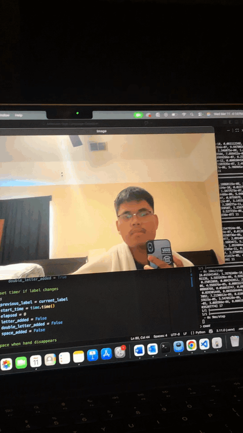

# ✌🏻 American Sign Language Detection & Speech Synthesis

A real-time ASL recognition system that uses Computer Vision and Machine Learning to translate hand gestures into text and spoken speech.



---

## 📌 Overview

This project captures live webcam input, detects hand gestures, classifies ASL letters using a trained model, constructs sentences over time, and converts the final sentence into realistic speech via the **Inworld AI Text-to-Speech API**.

---

## 🛠️ Tech Stack

| Category | Libraries / Tools |
|---|---|
| **Language** | Python 3 |
| **Computer Vision** | OpenCV (`cv2`), cvzone |
| **Machine Learning** | TensorFlow / Keras (via Teachable Machine) |
| **Numerical Computing** | NumPy |
| **Text-to-Speech** | Inworld AI TTS API, Requests, Base64 |
| **Utilities** | math, time, os, python-dotenv |

---

## ⚙️ Installation

### 1. Clone the repository

```bash
git clone https://github.com/yourusername/American-Sign-Language-Detection.git
cd American-Sign-Language-Detection
```

### 2. Create a virtual environment

```bash
python -m venv .venv
```

Activate it:

```bash
# macOS / Linux
source .venv/bin/activate

# Windows
.venv\Scripts\activate
```

### 3. Install dependencies

```bash
pip install -r requirements.txt
```

---

## 🔑 API Setup

Create a `.env` file in the project root and add your Inworld AI API key:

```env
INWORLD_API_KEY=Basic YOUR_API_KEY_HERE
```

> ⚠️ Never commit your `.env` file. Make sure it's listed in `.gitignore`.

---

## 🚀 Usage

Run the main detection script:

```bash
python main.py
```

### Keyboard Controls

| Key | Action |
|-----|--------|
| `q` | Quit the program |
| `c` | Clear the current sentence |

---

## 🗂️ Project Structure

```
American-Sign-Language-Detection/
├── sampleImage/
│   └── sampledemo.gif
├── model/                  # Trained Teachable Machine model
├── main.py                 # Main entry point
├── requirements.txt
├── .env                    # API key (not committed)
└── README.md
```

---

## 📄 License

This project is licensed under the [MIT License](LICENSE).